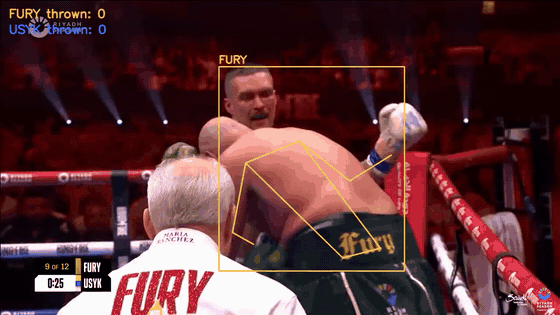

# boxing-judge

Scores boxing rounds from broadcast video with pose estimation and hand-written judging logic.
Test fight: Fury vs Usyk 1 (2024-05-18), split decision 115-112 / 114-113 Usyk, 114-113 Fury.
System card: **116-111 Usyk**. Punch detector precision **0.79** on a round checked frame by frame.



*Round 9, 30 s window. Only punches confirmed by a human review of 5-frame strips are drawn; the contact sheet of those punches is in [docs/verified_punches.jpg](docs/verified_punches.jpg). Ground truth comes only from the judges' cards, CompuBox and hand labels, never from the tracker's own output.*

Pipeline (run from `src/`, venv = `~/PycharmProjects/cv-insta/.venv`):

```
python shots.py        # camera cuts + per-frame pan estimate      -> data/shots.parquet
python track.py        # YOLO11m-pose + ByteTrack, reset per shot  -> data/tracks.parquet
python fighters.py     # who is a fighter / ref, A vs B by trunks  -> data/fighters.parquet
python rounds.py       # round boundaries from fighter presence    -> data/rounds.json
python punches.py      # punches THROWN per fighter (no landed)    -> data/punches.parquet
python ring.py         # advancing/retreating, knockdown candidates-> data/ring.parquet
python score.py        # 10-point must per round + vs judges       -> out/scores.csv
python validate.py     # vs CompuBox + vs hand labels
python verify_clip.py --start-sec 1800 --dur 30   # candidates + strips + contact sheets for a demo window
#   -> review out/verify/*, write labels/clip_1800_verdicts.csv (tp / fp / clinch / unclear, idx=-1 for hand-added punches)
python overlay.py --start-sec 1800 --dur 30 --verified labels/clip_1800_verdicts.csv   # clip drawn from verified punches only
```

Ground truth is external only: judges' cards (`data/cards.csv`), CompuBox (`data/compubox.csv`),
hand-labelled punches for two rounds (`labels/round_N.csv`). Nothing is labelled with the tracker's own output.

## Result (2026-09-19 evening; radial punch mode, thr=3.5)

System 116-111 Usyk (Fury R1, R2, R5, R7; R9 10-8 from the knockdown as a fact in `data/knockdowns.json`).
Judges: 115-112 Usyk, 114-113 Usyk, 114-113 Fury. Round agreement: Palomo 75%, Fitzgerald 50%, Metcalfe 58%.
Thrown: system Fury 450 / Usyk 435, CompuBox 496 / 407.

Punch detector, round 5, checked frame by frame (`labels/round_5_verdicts.csv`, `python eval_r5.py`):
235 verified candidates now (196 from the first pass + 39 new ones the radial mode surfaced, all viewed as 5-frame strips).
73 detections at the working threshold, 52 judged, **precision 0.79** (41 real, 3 identity, 3 clinch, 5 other); 41 of 86 verified punches recovered.
Threshold 3.0 finds 53 of 86 at precision 0.77, but the extra band (3.0-3.5) is a coin flip on the labelled round (11 real / 5 false)
and in the demo clip it adds three Fury arm movements while he is being hit; for the demo, precision wins.
The demo clip (round 9, 1800-1830 s): 10 detections, Usyk 7 / Fury 3. Before the 8 s mark Usyk 4 of 6 (misses at 1805.5 and 1806.0 sit at speed 3.1-3.4),
Fury 3 (an arm swing at 1802.9 and a clinch grab at 1806.8-1806.9). Neither wrist direction toward the opponent nor apparent size separates the low band.

Identity (who is Fury, who is Usyk), checked on 24-frame contact sheets of two 30 s stretches (round 5 exchange, round 9 knockdown):
wrong name on a real person in 0 of 24 frames (round 9 demo stretch) and 0 of 24 on the 1805.5-1808.3 zoom that used to swap.
On 48 random in-round frames across the fight: 1 clinch close-up (2 consecutive frames) with the names swapped, everything else right.

Two independent code reviews (2026-09-19) found 17 issues in `fighters.py` and 8 in `punches.py`; the ones with measured effect are applied:
- linking is a per-frame joint assignment (Hungarian) with a soft cost = geometry + trunks colour + CLIP disagreement + skin, hard vetoes only on clean crops,
  chain colour/label as EMAs (one polluted sample no longer vetoes the right chain), shoulders or box centre for distance (never the min of both)
- chain aggregates over non-overlapping crops only; pair tier respects the colour sign; opposite tier votes across all CLIP partners; glove hue dropped (white gloves have none)
- per-frame conflicts resolved by local evidence (own CLIP margin + trunks agreement), not by chain length; per-crop CLIP override is a swap of the pair unless the partner's own clean label objects
- punches: wrist dropouts of <= 2 frames interpolated instead of masked (+5 true positives, 0 new false), stance fixed per fighter (16% of punches had the wrong jab/power type), merge window respected, elbow angle masked by confidence, torso from shoulder width when hips are unseen
A fighter standing in the dark behind the ropes is invisible to YOLO (confidence 0.11) and gets no box rather than a wrong one.

What did not work and was replaced:
- ByteTrack drops a fighter for a frame on fast motion -> removed, detections are linked by centre distance in `fighters.py`.
- Colour heuristics for the referee: white shirt under red light == skin in HSV -> CLIP zero-shot per crop (`classify.py`), averaged per chain.
  Even so, a bare-chested close-up of Fury after the knockdown scored as "referee" for 6 s -> a referee chain must have a covered torso.
- CLIP on wide-shot crops says "spectator" -> identity by colour there. Absolute trunks brightness fails when lighting changes between shots,
  so the fallback is *relative*: of two people at least half a box apart, the darker trunks / greener gloves is Fury (`pair` tier), and a chain
  that shares frames with a CLIP-confident chain is the other man (`opposite` tier).
- One chain mixing both men (a box that widens in a clinch reaches the other man's last position and gets linked to his chain) ->
  a detection whose own CLIP label is confident never links to a chain whose last confident label is the other man, and a confident crop
  keeps its own name over the chain label (median of 5 frames).
- "Same name twice in a frame -> flip one" turned YOLO double boxes into a phantom second fighter -> a smaller box whose centre lies inside a
  bigger one is the same man and is dropped.
- Colour-only tiers named the referee (dark trousers) and crowd as Fury on wide shots -> a colour-only chain is a referee when CLIP's
  referee probability beats its fighter probability and the torso is covered, and nobody when it has neither a bare torso nor fighter probability.
- Per-shot two-slot tracking (`fighters_v2_slots.py`) was tried and rejected: slots mix at close range and the whole shot inherits the mix.
- Wrist velocity spikes at camera cuts / chain breaks counted as punches -> cut threshold lowered (193 -> 238 cuts), series split at chain changes, edge frames ignored.
- Clinches produce jab-like wrist speed -> boxes overlapping IoU > 0.4 are skipped; only catches the tight ones.
- Pose-based knockdown detection fires constantly in clinches -> facts only.
- Round boundaries from fighter presence merge everything (breaks are cut in the video) -> the on-screen clock box.
- "Wrist moving toward the opponent's hips" as the punch signal missed hooks and uppercuts (they go sideways / up) and anything at close range
  where the direction vector is meaningless -> the signal is now the fist leaving the body (rate of change of wrist distance from the torso centre),
  with a floor on absolute wrist speed. Punches cut off by a camera cut used to be lost because a maximum on the segment edge is not a peak ->
  segments are zero-padded; the same hand within 0.3 s is one punch (a detection gap used to split one punch into two edge peaks).
- A wrist keypoint that drops out (confidence < 0.35, placed near the body) and reappears on the extended arm read as a punch,
  so one punch counted twice or three times -> distance is NaN on unconfident frames and no speed is computed across them.
  Cost: a real punch whose peak frame touches a detection gap is lost (the uppercut at 1805.0 in the clip).
- A missed camera cut inside a chain still gave one wrist jump -> a segment also breaks where the fighter's box centre jumps > 0.5 heights.
- Arm swings after the knockdown / while walking counted -> a punch needs the opponent in frame within 0.25 s.
- The torso-length scale switched per frame between a hips-based estimate and a shoulder-width fallback whenever the hips were unseen
  (most clinch close-ups): a 3-4x scale jump reads as an 8-12 torso/s punch. The scale is now a rolling median over hips-visible frames,
  carried across the unseen ones. A hand dropping to the side also "leaves the body" -> motion steeper than ~50 deg below horizontal is not a punch.
- A fighter dropped by identity for a single frame cut the punch series in half, and the halves had no peak -> single-frame gaps are bridged
  by interpolating the two neighbours. Continuity is judged on shoulder midpoints (or box centres, never mixed per pair): a box that
  balloons around an extended arm is not a camera cut. Segments no longer break on chain-id changes, only on real jumps.
- Clinch grabs (a hand on the opponent's neck) still count as punches; every geometric clinch rule tried (box overlap, containment,
  hip distance) removes as many verified punches as clinches, so none is applied.
- A single-frame name flip inside a chain (CLIP confidently calling Usyk's back "fury" for 4 frames) -> final per-chain median
  smoothing over 7 frames; a name cannot flip for fewer than 4 frames.
- Overlay boxes from the YOLO box looked wrong in clinches (one box around both men) -> boxes are drawn around the skeleton.

Demo clip is verified, not raw: every candidate in the 1800-1830 s window (32 at a low threshold) was viewed as a 5-frame strip, the
whole window as contact sheets, the two corner exchanges frame by frame, and `out/clip_r9_verified.mp4` draws only the 12 verified
punches (Usyk 11, Fury 1; 7 Usyk before 1808 s). Each counted punch shows its own photo as an inset for 1.5 s, the video time is printed top right, and
`out/clip_r9_verified_punches.jpg` is the scorecard: one crop per point. The raw detector at its working threshold finds 8 of the 12
and adds 3 that are not punches (`out/clip_r9.mp4` is the raw version).

Still open: recall (needs labels of every punch in a round, not just proposals); clinch detection beyond box overlap;
CompuBox round-by-round rows (only totals and the combination graphic are public).

## License

MIT, see [LICENSE](LICENSE).
